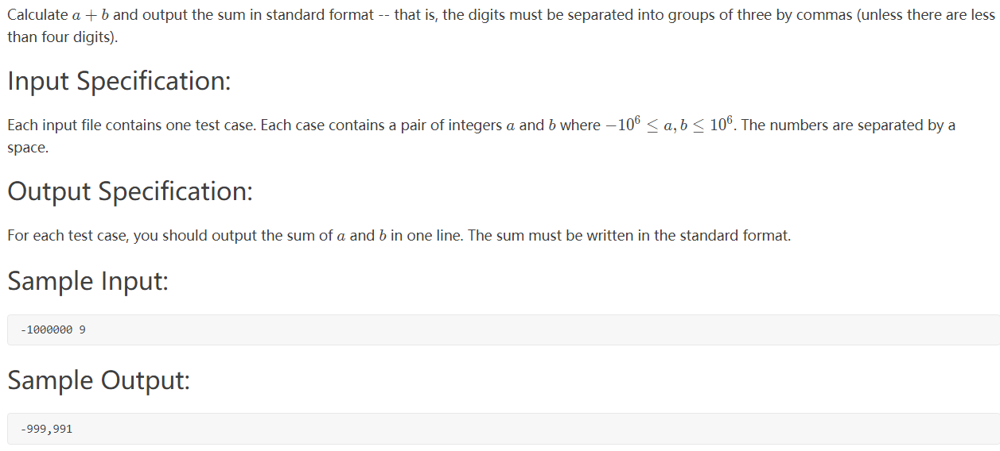

# 题目



# 代码

## （1）一刷

```C++
#include <iostream>
using namespace std;
#include <stdio.h>
#include <string>
#include <sstream>
#include <algorithm>

int main()
{
    int a, b;
    while (cin >> a >> b)
    {
        int sum = a + b;
        string str;
        stringstream os;
        os << sum;
        os >> str;
        
        int n = str.size();
        if (n <= 3)
        {
            cout << sum << endl;
            continue;
        }
        int count = 0;
        string s;
        for (int i = n - 1; i >= 0; i--)
        {
            if (count == 3 && str[i] != '-')
            {
                s.push_back(',');
                count = 0;
                i++;
            }
            else
            {
                s.push_back(str[i]);
                count++;
            }
        }
        reverse(s.begin(), s.end());
        cout << s << endl;
    }

    return 0;
}
```


## （2）二刷

不太理想，卡了很多测试点？

```cpp
#include <iostream>
using namespace std;
#include <string>
#include <algorithm>

int main()
{
    int x, y;
    while (cin >> x >> y)
    {
        int num = x + y;
        string s = to_string(num);
        int n = s.size();
        int count = 0;
        string ans;
        int k = 0;
        if (num < 0)
            k = 1;
        for (int i = n - 1; i >= k; i--)
        {
            count++;
            
            ans += s[i];
            if (count % 3 == 0)
            {
                ans += ",";
            }
        }
        if (count % 3 == 0)
            ans.pop_back();
        if (k == 1)
            ans += "-";
        reverse(ans.begin(), ans.end());
        cout << ans << endl;
    }
    return 0;
}
```

