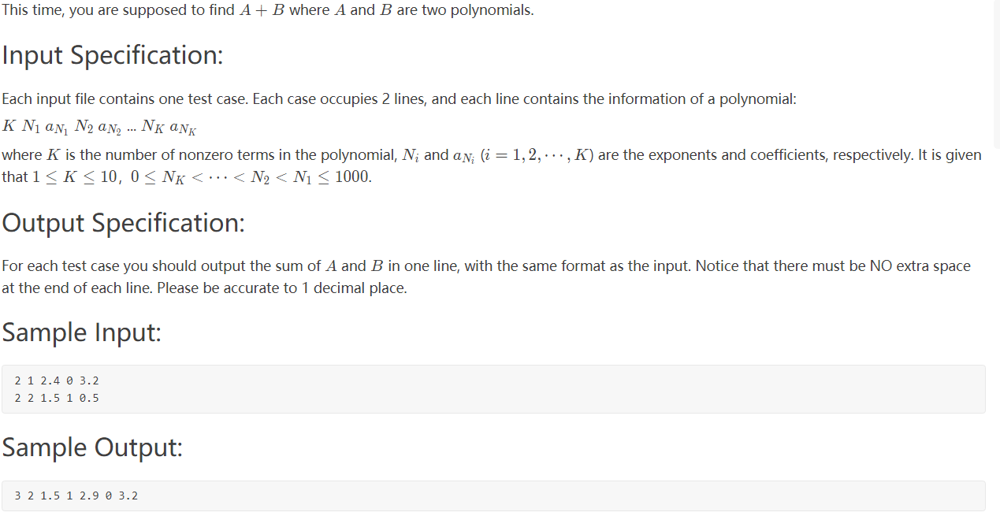

# 题目



# 关键

1. 输出规定保留一位小数！！！
2. 如果结果为0，即计算过程中加减可能为0，那么结果为0不需要输出！！！所以总数要额外计算。

# 代码

```c++
#include <iostream>
using namespace std;
#include <stdio.h>
#include <string>
#include <sstream>
#include <algorithm>
#include <map>

int main()
{
    int n;
    map<int, double> map1;

    //1.取数据
    cin >> n;
    for (int i = 0; i < n; i++)
    {
        int key;
        double value;
        cin >> key >> value;
        map1[key] = value;
    }
    cin >> n;
    for (int i = 0; i < n; i++)
    {
        int key;
        double value;
        cin >> key >> value;
        auto it = map1.find(key);
        if (it == map1.end())
        {
            map1[key] = value;
        }
        else
        {
            map1[key] += value;
        }
    }

    int sum = 0;
    //2.计算长度，因为这有一个坑点：不能输出值为0的节点
    for (auto it = map1.begin(); it != map1.end(); it++)
    {
        if (it->second == 0)
            continue;
        sum++;
    }

    cout << sum;
    for (auto it = map1.rbegin(); it != map1.rend(); it++)
    {
        if (it->second != 0)
            printf(" %d %.1lf", it->first, it->second);//因为规定输出保留一位小数
    }
    cout << endl;

    return 0;
}
```


# 二刷

思路还是通过map来比较好，注意输出精度和0即可。

```cpp
#include <iostream>
using namespace std;
#include <map>

int main()
{
    int n;
    cin >> n;
    map<int, double> myMap;
    for (int i = 0; i < n; i++)
    {
        int c1;
        double c2;
        cin >> c1 >> c2;
        myMap[c1] += c2;
    }
    cin >> n;
    for (int i = 0; i < n; i++)
    {
        int c1;
        double c2;
        cin >> c1 >> c2;
        myMap[c1] += c2;
    }
    n = myMap.size();
    for (auto num : myMap)
    {
        if (num.second == 0)
            n--;
    }
    cout << n;
    for (auto it = myMap.rbegin(); it != myMap.rend(); it++)
    {
        if (it->second != 0)
        {
            printf(" %d %.1lf", it->first, it->second);
        }
    }


    return 0;
}
```
