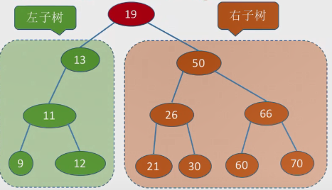

# 一、概念

1. 二叉排序树，又称二叉查找树（BST，Binary Search Tree）。

2. 按中序遍历的角度看，左子树结点值<根结点值<右子树结点值。也就是说，对二叉排序树进行一次中序遍历，可以得到一个递增的有序序列。

   

3. 二叉排序的删除相对比较复杂，可直接看代码：

   - 如果是叶子节点，直接删除即可
   - 如果只有左子树或右子树，左子树或右子树黏在父子树的左或右
   - 如果既有左子树又有右子树，可以找到右子树中的最小值（即中序遍历右子树中第一个遍历的），将其作为删除结点所在位置的根节点，最小值的右子树为最小值父子树的左子树，删除结点的左子树和右子树作为最小值的左右子树。
   - 每种情况都需要考虑删除的结点是根节点的问题。


# 二、代码

## 2.1 寻找结点

```C++
//1.在二叉树中寻找值为key的节点
BSTNode* BST_Search(BSTree T, int key)
{
    while (T != NULL && key != T->key)
    {
        if (key < T->key)
            T = T->lchild;
        else
            T = T->rchild;
    }
    return T;   //没找到返回T
}

//2.递归实现找到key的节点
BSTNode* BSTSearch(BSTree T, int key)
{
    if (T == NULL)
    {
        return NULL;
    }

    if (key == T->key)
        return T;
    else if (key < T->key)
        return BSTSearch(T->lchild, key);
    else
        return BSTSearch(T->rchild, key);
    
}
```

## 2.2 插入结点

```C++
//3.在二叉树中插入值为k的新结点
bool BST_Insert(BSTree &T, int k)
{
    if (T == NULL)//表示此结点是上一个结点的空的左子树或右子树,或者一个空树
    {
        T = (BSTNode*)calloc(1, sizeof(BSTNode));
        if (T == NULL)
            return false;
        T->key = k;
        T->lchild = T->rchild = NULL;
        return true;
    }

    if (k == T->key)//存在值相同，不插入
        return false;
    else if (k < T->key)
        return BST_Insert(T->lchild, k);
    else
        return BST_Insert(T->rchild, k);
}
```

## 2.3 构建二叉树-数组

```C++
//4.构建二叉排序树，通过数组str,n是长度
void BST_Create(BSTree& T, int str[], int n)
{
    int i = 0;
    T = NULL;
    for (int i = 0; i < n; i++)
    {
        BST_Insert(T, str[i]);
    }
}
```

## 2.4 中序遍历

```C++
//5.中序遍历
void InNode(BSTree T)
{
    if (T)
    {
        InNode(T->lchild);
        cout << T->key << endl;
        InNode(T->rchild);
    }
}
```

## 2.5 删除结点

```C++
//6. 删除值为k的元素
BSTNode* pre = NULL;
bool BST_Delete(BSTree T, int k)
{
    if (T == NULL)
        return false;

    if (k == T->key)//找到了
    {
        if (T->lchild == NULL && T->rchild == NULL)//叶子节点
        {
            if (!pre)//根节点
            {
                free(T);
                root = NULL;
                return true;
            }

            if (pre->lchild && pre->lchild->key == k)//pre的左子节点
            {
                pre->lchild = NULL;
                free(T);
                pre = NULL;
                return true;
            }
            else
            {
                pre->rchild = NULL;
                free(T);
                pre = NULL;
                return true;
            }
        }
        else if (T->lchild && T->rchild)//左子树和右子树都有结点
        {
            //法1：找到右子树中最左边的，也就是最小的替代删除的位置
            

            BSTNode* node = T->rchild;
            BSTNode* nodePre = T;
            while (node->lchild)   //找到T的右子树中最左边的，即中序遍历的第一个，最小值
            {
                nodePre = node;
                node = node->lchild;
            }

            nodePre->lchild = node->rchild;//最小值的根节点的左子树为最小值的右子树
            if (!pre)//根结点
            {
                root = node;
            }
            else if (pre->lchild->key == k)
            {
                pre->lchild = node;
            }
            else if(pre->rchild->key == k)
            {
                pre->rchild = node;
            }
            node->lchild = T->lchild;
            node->rchild = T->rchild;
     
            free(T);
            pre = NULL;
            return true;


        }
        else   //只有左或只有右
        {
            if (!pre)
            {
                if (T->lchild)
                    root = T->lchild;
                else
                    root = T->rchild;
                free(T);
                return true;
            }
            if (T->lchild)//只有左孩子
            {
                if (pre->lchild && pre->lchild->key == k)//上一个结点的左孩子
                {
                    pre->lchild = T->lchild;
                    free(T);
                    pre = NULL;
                    return true;
                }
                else
                {
                    pre->rchild = T->lchild;
                    free(T);
                    pre = NULL;
                    return true;
                }
            }
            else    //只有右孩子
            {
                if (pre->lchild && pre->lchild->key == k)//上一个结点的左孩子
                {
                    pre->lchild = T->rchild;
                    free(T);
                    pre = NULL;
                    return true;
                }
                else
                {
                    pre->rchild = T->rchild;
                    free(T);
                    pre = NULL;
                    return true;
                }
            }
        }
      
            
    }
    else if (k < T->key)
    {
        pre = T;
        return BST_Delete(T->lchild, k);
    }
    else
    {
        pre = T;
        return BST_Delete(T->rchild, k);
    }
        
}
```


## 2.6 完整代码

```C++
#include <iostream>
using namespace std;


typedef int ElemType;
typedef struct BSTNode
{
    int key;
    struct BSTNode* lchild, * rchild;
}BSTNode, *BSTree;

BSTree root = NULL;

//1.在二叉树中寻找值为key的节点
BSTNode* BST_Search(BSTree T, int key)
{
    while (T != NULL && key != T->key)
    {
        if (key < T->key)
            T = T->lchild;
        else
            T = T->rchild;
    }
    return T;   //没找到返回T
}

//2.递归实现找到key的节点
BSTNode* BSTSearch(BSTree T, int key)
{
    if (T == NULL)
    {
        return NULL;
    }

    if (key == T->key)
        return T;
    else if (key < T->key)
        return BSTSearch(T->lchild, key);
    else
        return BSTSearch(T->rchild, key);
    
}


//3.在二叉树中插入值为k的新结点
bool BST_Insert(BSTree &T, int k)
{
    if (T == NULL)//表示此结点是上一个结点的空的左子树或右子树,或者一个空树
    {
        T = (BSTNode*)calloc(1, sizeof(BSTNode));
        if (T == NULL)
            return false;
        T->key = k;
        T->lchild = T->rchild = NULL;
        return true;
    }

    if (k == T->key)//存在值相同，不插入
        return false;
    else if (k < T->key)
        return BST_Insert(T->lchild, k);
    else
        return BST_Insert(T->rchild, k);
}

//4.构建二叉排序树，通过数组str,n是长度
void BST_Create(BSTree& T, int str[], int n)
{
    int i = 0;
    T = NULL;
    for (int i = 0; i < n; i++)
    {
        BST_Insert(T, str[i]);
    }
}

//5.中序遍历
void InNode(BSTree T)
{
    if (T)
    {
        InNode(T->lchild);
        cout << T->key << endl;
        InNode(T->rchild);
    }
}


//6. 删除值为k的元素
BSTNode* pre = NULL;
bool BST_Delete(BSTree T, int k)
{
    if (T == NULL)
        return false;

    if (k == T->key)//找到了
    {
        if (T->lchild == NULL && T->rchild == NULL)//叶子节点
        {
            if (!pre)//根节点
            {
                free(T);
                root = NULL;
                return true;
            }

            if (pre->lchild && pre->lchild->key == k)//pre的左子节点
            {
                pre->lchild = NULL;
                free(T);
                pre = NULL;
                return true;
            }
            else
            {
                pre->rchild = NULL;
                free(T);
                pre = NULL;
                return true;
            }
        }
        else if (T->lchild && T->rchild)//左子树和右子树都有结点
        {
            //法1：找到右子树中最左边的，也就是最小的替代删除的位置
            

            BSTNode* node = T->rchild;
            BSTNode* nodePre = T;
            while (node->lchild)   //找到T的右子树中最左边的，即中序遍历的第一个，最小值
            {
                nodePre = node;
                node = node->lchild;
            }

            nodePre->lchild = node->rchild;//最小值的根节点的左子树为最小值的右子树
            if (!pre)//根结点
            {
                root = node;
            }
            else if (pre->lchild->key == k)
            {
                pre->lchild = node;
            }
            else if(pre->rchild->key == k)
            {
                pre->rchild = node;
            }
            node->lchild = T->lchild;
            node->rchild = T->rchild;
     
            free(T);
            pre = NULL;
            return true;


        }
        else   //只有左或只有右
        {
            if (!pre)
            {
                if (T->lchild)
                    root = T->lchild;
                else
                    root = T->rchild;
                free(T);
                return true;
            }
            if (T->lchild)//只有左孩子
            {
                if (pre->lchild && pre->lchild->key == k)//上一个结点的左孩子
                {
                    pre->lchild = T->lchild;
                    free(T);
                    pre = NULL;
                    return true;
                }
                else
                {
                    pre->rchild = T->lchild;
                    free(T);
                    pre = NULL;
                    return true;
                }
            }
            else    //只有右孩子
            {
                if (pre->lchild && pre->lchild->key == k)//上一个结点的左孩子
                {
                    pre->lchild = T->rchild;
                    free(T);
                    pre = NULL;
                    return true;
                }
                else
                {
                    pre->rchild = T->rchild;
                    free(T);
                    pre = NULL;
                    return true;
                }
            }
        }
      
            
    }
    else if (k < T->key)
    {
        pre = T;
        return BST_Delete(T->lchild, k);
    }
    else
    {
        pre = T;
        return BST_Delete(T->rchild, k);
    }
        
}


int main()
{
    //二叉排序树
    
    int arr[] = { 50, 66, 60, 26, 21, 30, 70, 68 };
    BST_Create(root, arr, 8);
    InNode(root);
    BST_Delete(root, 50);
    cout << "删除后：" << endl;
    InNode(root);
    //BST_Delete(root, 66);

    return 0;
    
}
```

