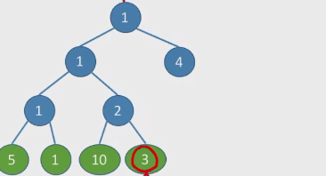
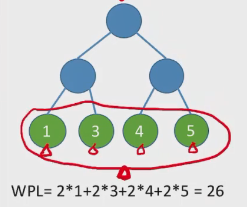
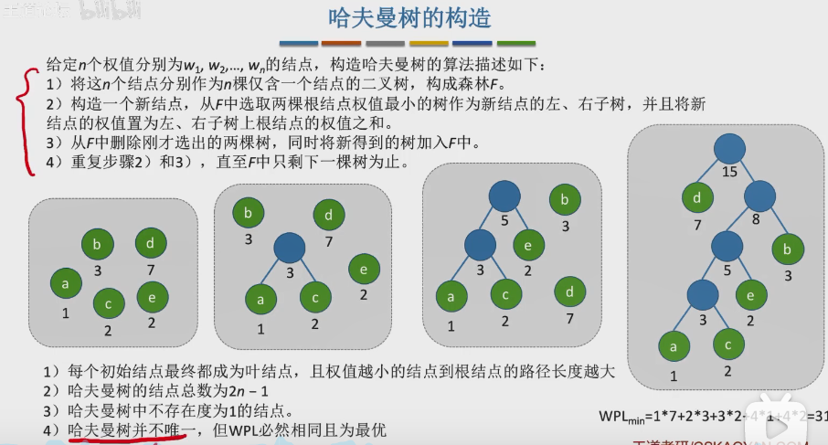
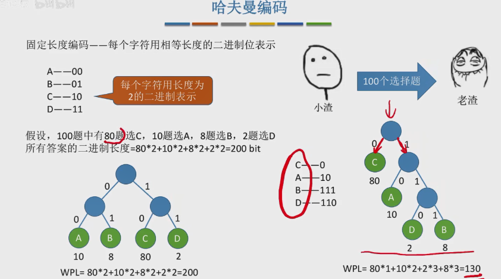
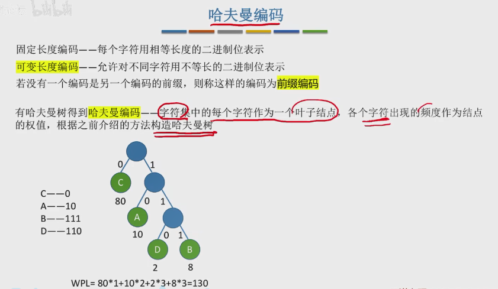

# 一、概念

## 1.1 带权路径长度

结点的**权**：有某种现实含义的数字（如：表示结点的重要性）。

结点的**带权路径长度**：从树的根到该结点的路径**长度**（经过的边数）与该结点上权值的乘积。如图中所圈：3*3 = 9。

树的带权路径长度（**WPL**）：数中所有叶子结点的带权路径长度之和。

例子：

## 1.2 哈夫曼树

- 在含有n个带权叶子结点的二叉树中，其中**带权路径长度（WPL）**最小的二叉树成为哈夫曼树，也称最优二叉树。

- 哈夫曼树并不唯一，但是WPL确是最优的。

## 1.3 哈夫曼树的构造

## 1.4 哈夫曼编码

采用前缀编码，即没有一个编码是另一个编码的前缀。

哈夫曼编码可以用于数据的压缩。