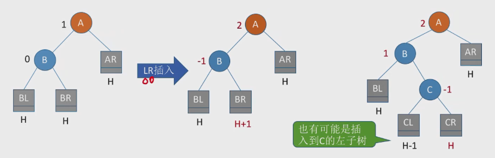
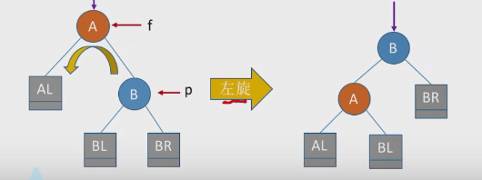

# 一、概念

1. 平衡二叉树（Balanced Binary Tree），简称平衡树（AVL树）。树上任一结点的左子树和右子树的高度之差不超过1。
2. 平衡二叉树，是在**排序二叉树**的基础上，使得排序二叉树更加合理（分布更加均匀）。本身也符合排序二叉树的特点。
3. 结点的**平衡因子**：左子树高 - 右子树高。因此，平衡二叉树结点的平衡因子的值只可能-1、0、1。只要有任意一个结点的平衡因子大于1，就不是二叉平衡树。
4. 二叉排序树的**查找效率**：O（logn）
5. n(h) = n(h-1) + n(h-2) + 1，其中：n(0)=0，n(1)=1。n(h)表示深度为h的平衡数含有的最少结点数。因此，给定一个结点数，可以知道其最大深度。

结构体定义：

```cpp
typedef struct AVLNode
{
    int key;
    int balance;//平衡因子,平衡二叉树区别于排序二叉树的参数
    struct AVLNode* lchild, * rchild;
}AVLNode, *AVLTree;
```


# 二、思路和代码

## 2.1 平衡二叉树的插入的情况

1. 新插入一个结点，按照排序二叉树的方式先找到插入的位置并插入。因为插入一个新的结点，那么插入的路径上的所有结点都会受到影响。此时，我们需要找到**最小不平衡子树**，从插入结点位置往上找到第一个非平衡结点（平衡因子绝对值大于1），路径包围的树就是最小不平衡子树。此时我们需要调整最小不平衡子树，使其**恢复平衡**，这样整个树就恢复平衡了。
2. 那么如何调整最小不平衡子树呢，以下分四种情况：
   1. **LL**，在A的左孩子的左子树中插入导致不平衡
   2. **RR**，在A的右孩子的右子树中插入导致不平衡
   3. **LR**，在A的左孩子的右孩子中插入导致不平衡
   4. **RL**，在A的右孩子的左孩子中插入导致不平衡

## 2.2 调整方案

1. LL平衡旋转（**右单旋转**）。由于，在结点A的左孩子（L）的左子树（L）上插入了新结点。A的平衡因子由1增至2，导致以A为根的子树失去平衡，需要一次向右的旋转操作。将A的左孩子**B向右上旋**转代替A成为根结点，将**A结点向右下旋转成为B的右子树**的根结点，而**B的原右子树**则作为A结点的左子树。

   二叉排序树的特性：左子树结点值 < 根结点值 < 右子树结点值

   BL < B < HR < A < AR

   

   

2. RR平衡旋转（**左单旋转**）。由于在结点A的右孩子（R）的右子树（R）上插入了新结点，A的平衡因子由-1减至-2，导致以A为根的子树失去平衡，需要一次向左的旋转操作。将A的右孩子B向左上旋转代替A成为根结点，将A结点向左下旋转成为B的左子树的根结点，而B的原左子树则作为A结点的右子树。

   二叉排序树：左子树结点值 < 根结点值 < 右子树结点值

   AL < A < BL < B < BR

   

   

3. LR平衡旋转（先左后右）。由于在A的左结点B的右子树插入新的结点，A的平衡因子由1增至2，导致以A为根的子树失去平衡，需要两次旋转操作，**先左旋后右旋**。先将A结点的左孩子B的右子树的根结点C向左上旋转提升到B结点的位置，然后再把该C结点向右上旋转提升到A结点的位置。

   

   

   

4. RL平衡旋转（先右后左双旋转）。由于在A的右孩子的左子树插入新结点，A的平衡因子由-1减至-2，导致以A为根的子树失去平衡，需要两次旋转操作，**先右旋后左旋**。先将A结点的右孩子B的左子树的根结点C向右上旋转提升至B结点的位置，然后再把该C结点向左上旋转提升到A结点的位置。

   

   

**调整思路总结**：

1. LL：A的左孩子结点右上旋
2. RR：A的右孩子结点左上旋
3. LR：A的左孩子的右孩子，先左上旋后右上旋
4. RL：A的右孩子的左孩子，先右上旋后左上旋


## 2.3 代码思路

（1）实现右上旋思路

```cpp
A->lchild = B->rchild;
B->rchild = A;
gf->lchild/rchild = B;//其中gf为A的父结点
```


（2）实现左上旋思路

```cpp
A->rchild = B->lchild;
B->lchild = A;
pf->lchild/rchild = B;//pf为A的根结点
```



（3）不管是LL、RR、LR、RL，符合以上两种思路：右上旋和左上旋。只不过LL、RR可能只要旋转一次，而LR、RL需要旋转两次。