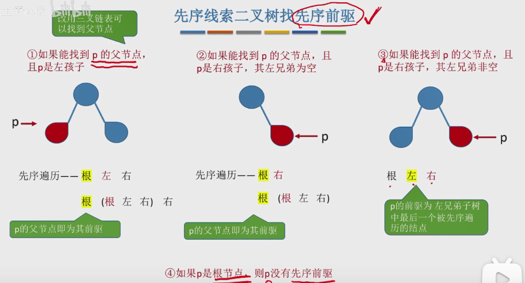
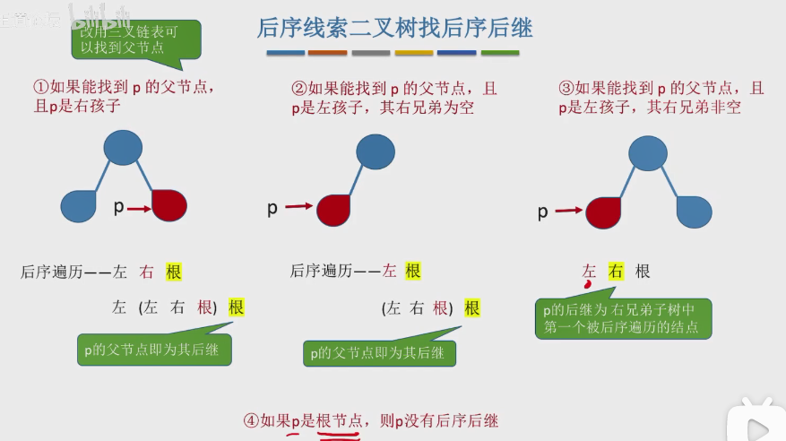

# 一、概念

1. 普通二叉树找前驱和后继麻烦，所以采用线索二叉树。n个结点的二叉树有n+1个空链域，可以用来存储前驱、后继信息。**ps**:这里所谓的前驱、后继，是相对于遍历方式来说的（如：先序、后序遍历）。
2. 其中**先序**遍历线索化时有所不同。需要我们判断，左节点是否被线索化再进行递归操作。
3. 找先序前驱和后序后继时，需要知道其根节点。因为先序前驱在其孩子无法找到，而后序后继也无法在其孩子找到。当然，如果这两种情况都已经被线索化了，那么直接通过线索化就可以找到了。


# 二、代码

## 2.1结构体定义

```c++
typedef int ElemType;
typedef struct ThreadNode
{
    ElemType data;
    struct ThreadNode* lchild, * rchild;
    int ltag, rtag; //左、右线索标志,=0表示指向孩子，=1表示指向线索
}ThreadNode, *ThreadTree;
```


## 2.2 线索化二叉树

```c++
//访问过程中的操作
void visit(ThreadNode* q)
{
    if (!q->lchild)//当前结点左孩子为空，线索化前驱
    {
        q->lchild = pre;
        q->ltag = 1;
    }
    if (pre && !pre->rchild)//上一个结点不为空且上一个结点无右孩子，给上一个结点添加后继
    {
        pre->rchild = q;//上一个结点的后继为当前结点
        pre->rtag = 1;
    }
    pre = q;
    cout << q->data << endl;
}
```


### 2.2.1 中序线索化

```C++
//中序遍历二叉树并线索化
void InThread(ThreadTree T)
{
    if (T)
    {
        InThread(T->lchild);
        visit(T);
        InThread(T->rchild);
    }
}
//中序线索化二叉树
void CreateInThread(ThreadTree T)
{
    pre = NULL;//第一个结点无前驱
    if (T)
    {
        InThread(T);
        if (pre->rchild == NULL)    //处理最后一个结点，后继为NULL
            pre->rtag = 1;
    }
}
```


### 2.2.2 先序线索化

```c++
//先序遍历二叉树
void PreThread(ThreadTree T)
{
    if (T)
    {
        visit(T);
        if (T->ltag == 0)
            PreThread(T->lchild);
        PreThread(T->rchild);
    }
}
//先序线索化
void CreatePreThread(ThreadTree T)
{
    pre = NULL;
    if (T)
    {
        PreThread(T);
        if (pre->rchild == NULL)
            pre->rtag = 1;
    }
}
```


### 2.2.3 后序线索化

```c++
//后序遍历二叉树
void PostThread(ThreadTree T)
{
    if (T)
    {
        PostThread(T->lchild);
        PostThread(T->rchild);
        visit(T);
    }
}
//后序线索化
void CreatePostThread(ThreadTree T)
{
    pre = NULL;
    if (T)
    {
        PostThread(T);
        if (pre->rchild == NULL)
            pre->rtag = 1;
    }
}
```


## 2.3 查找前驱、后继

### 2.3.1 中序遍历

```C++
（1）后继
//找到以p为根的子树中，第一个被中序遍历的节点
ThreadNode* FirstNode(ThreadNode* p)
{
    while (p->ltag == 0)//找到最后一个左子树
    {
        p = p->lchild;
    }
    return p;
}
//在中序线索二叉树中找到节点p的后继节点
ThreadNode* NextNode(ThreadNode* p)
{
    if (p->rtag == 0)
        return FirstNode(p->rchild);
    else
        return p->rchild;   //rtag==1则右子树线索化为后继
}

（2）前驱
//找到根节点为p的子树中，最后一个被中序遍历的节点
ThreadNode* LastNode(ThreadNode* p)
{
    while (p->rtag == 0)
    {
        p = p->rchild;
    }
    return p;
}
//中序线索二叉树中找到节点p的前驱
ThreadNode* PreNode(ThreadNode* p)
{
    if (p->ltag == 0)
        return LastNode(p->lchild);
    else
        return p->lchild;
}
```


### 2.3.2 先序遍历

```C++
//找先序后继
ThreadNode* InNode(ThreadNode* p)
{
    if (p->rtag == 1)//线索化
    {
        return p->rchild;
    }
    else    //否则，存在左节点就是左节点；存在右结点就是右结点
    {
        if (p->lchild)
            return p->lchild;
        else
            return p->rchild;
    }
}
```

先序前驱比较复杂：

- 土办法，从头开始找
- 三叉链表，找到根节点再进行判断




### 2.3.3 后序遍历

```c++
//找后序前驱
ThreadNode* PostNode(ThreadNode* p)
{
    if (p->ltag == 1)
        return p->lchild;
    else
    {
        if (p->rchild)
            return p->rchild;
        else
            return p->lchild;
    }
}
```

后序后继和先序前驱类似：

- 土办法
- 三叉链表，需要找到根节点




## 2.4 完整代码

```c++
#include <iostream>
using namespace std;


typedef int ElemType;
typedef struct ThreadNode
{
    ElemType data;
    struct ThreadNode* lchild, * rchild;
    int ltag, rtag; //左、右线索标志,=0表示指向孩子，=1表示指向线索
}ThreadNode, *ThreadTree;

//全局pre，指向当前访问节点的前驱
ThreadNode* pre = NULL;

//访问过程中的操作
void visit(ThreadNode* q)
{
    if (!q->lchild)//当前结点左孩子为空，线索化前驱
    {
        q->lchild = pre;
        q->ltag = 1;
    }
    if (pre && !pre->rchild)//上一个结点不为空且上一个结点无右孩子，给上一个结点添加后继
    {
        pre->rchild = q;//上一个结点的后继为当前结点
        pre->rtag = 1;
    }
    pre = q;
    cout << q->data << endl;
}

/******一、线索化二叉树******/
//中序遍历二叉树并线索化
void InThread(ThreadTree T)
{
    if (T)
    {
        InThread(T->lchild);
        visit(T);
        InThread(T->rchild);
    }
}
//中序线索化二叉树
void CreateInThread(ThreadTree T)
{
    pre = NULL;//第一个结点无前驱
    if (T)
    {
        InThread(T);
        if (pre->rchild == NULL)    //处理最后一个结点，后继为NULL
            pre->rtag = 1;
    }
}


//先序遍历二叉树
void PreThread(ThreadTree T)
{
    if (T)
    {
        visit(T);
        if (T->ltag == 0)
            PreThread(T->lchild);
        PreThread(T->rchild);
    }
}
//先序线索化
void CreatePreThread(ThreadTree T)
{
    pre = NULL;
    if (T)
    {
        PreThread(T);
        if (pre->rchild == NULL)
            pre->rtag = 1;
    }
}


//后序遍历二叉树
void PostThread(ThreadTree T)
{
    if (T)
    {
        PostThread(T->lchild);
        PostThread(T->rchild);
        visit(T);
    }
}
//后序线索化
void CreatePostThread(ThreadTree T)
{
    pre = NULL;
    if (T)
    {
        PostThread(T);
        if (pre->rchild == NULL)
            pre->rtag = 1;
    }
}


/******二、找前驱、后继******/
//找到以p为根的子树中，第一个被中序遍历的节点
ThreadNode* FirstNode(ThreadNode* p)
{
    while (p->ltag == 0)//找到最后一个左子树
    {
        p = p->lchild;
    }
    return p;
}
//在中序线索二叉树中找到节点p的后继节点
ThreadNode* NextNode(ThreadNode* p)
{
    if (p->rtag == 0)
        return FirstNode(p->rchild);
    else
        return p->rchild;   //rtag==1则右子树线索化为后继
}

//找到根节点为p的子树中，最后一个被中序遍历的节点
ThreadNode* LastNode(ThreadNode* p)
{
    while (p->rtag == 0)
    {
        p = p->rchild;
    }
    return p;
}
//中序线索二叉树中找到节点p的前驱
ThreadNode* PreNode(ThreadNode* p)
{
    if (p->ltag == 0)
        return LastNode(p->lchild);
    else
        return p->lchild;
}


//找先序后继
ThreadNode* InNode(ThreadNode* p)
{
    if (p->rtag == 1)//线索化
    {
        return p->rchild;
    }
    else    //否则，存在左节点就是左节点；存在右结点就是右结点
    {
        if (p->lchild)
            return p->lchild;
        else
            return p->rchild;
    }
}


//找后序前驱
ThreadNode* PostNode(ThreadNode* p)
{
    if (p->ltag == 1)
        return p->lchild;
    else
    {
        if (p->rchild)
            return p->rchild;
        else
            return p->lchild;
    }
}

int main()
{
    //线索二叉树
    ThreadTree root = (ThreadTree)calloc(1, sizeof(ThreadNode));
    root->data = 1;
    ThreadNode* t2 = (ThreadNode*)calloc(1, sizeof(ThreadNode));
    ThreadNode* t3 = (ThreadNode*)calloc(1, sizeof(ThreadNode));
    t2->data = 2;
    t3->data = 3;
    root->lchild = t2;
    root->rchild = t3;
    ThreadNode* t4 = (ThreadNode*)calloc(1, sizeof(ThreadNode));
    ThreadNode* t5 = (ThreadNode*)calloc(1, sizeof(ThreadNode));
    t4->data = 4;
    t5->data = 5;
    t2->lchild = t4;
    t2->rchild = t5;
    ThreadNode* t6 = (ThreadNode*)calloc(1, sizeof(ThreadNode));
    t6->data = 6;
    t3->rchild = t6;

    CreatePreThread(root);
    cout << InNode(t4)->data << endl;

    return 0;
    
}
```

